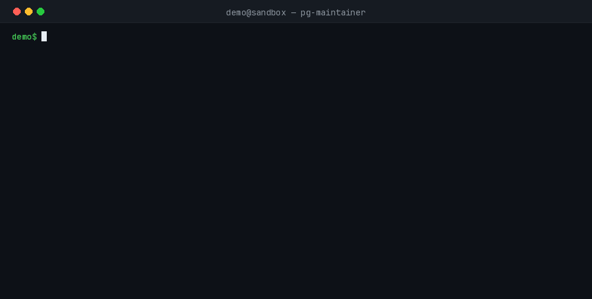

# pg-maintainer

A single-threaded PostgreSQL table maintenance tool written in Rust. It runs five sequential maintenance phases against one or more schemas, targeting only the tables that actually need work. **Requires PostgreSQL 14+.**



## Why pg-maintainer?

- **No extensions required** — vacuum/analyze/freeze use only standard `pg_catalog` views; bloat detection is statistics-based (`pg_stat_user_tables`), not `pgstattuple` or `pg_repack`. Works on any standard PostgreSQL installation, including managed services where you can't install extensions.
- **Targets only what needs work** — each mode discovers real candidates (never vacuumed, never analyzed, wraparound risk, or bloat above threshold) instead of blindly running maintenance across every table.
- **Safe by default** — active-vacuum detection skips conflicting tables (or terminates them with `--force`); a 10ms `lock_timeout` makes runs fail fast instead of blocking production traffic; `--dry-run` previews every action before anything executes.
- **Size-aware** — `--min-table-size-gb`/`--max-table-size-gb` exclude tiny or oversized tables from any mode.
- **Flexible credentials** — `PG_PASSWORD` env var, `PG_PASSWORD_FILE` (Docker/Kubernetes secrets), `.pgpass`, or CLI flag (with an insecurity warning). No plaintext passwords required in scripts.
- **Container-ready** — ships as a Docker image; all connection config comes from environment variables or mounted secrets, so it drops straight into a Kubernetes `CronJob` or a docker-compose one-off job.
- **Single connection, sequential execution** — no thread pool, no partial state to reconcile; straightforward to reason about and safe to re-run.

## Who Is This For?

- **DBAs and SREs** who want scheduled vacuum/analyze/freeze/bloat maintenance without hand-rolling SQL scripts.
- **Teams on managed PostgreSQL** (RDS, Aurora, Cloud SQL, Supabase, Neon, etc.) where extension-based tools like `pgstattuple` or `pg_repack` aren't installable — pg-maintainer only reads standard catalog views and statistics.
- **Infrastructure/platform engineers** who want a single container or binary to drop into a cron job, Kubernetes `CronJob`, or CI pipeline step.
- **Small teams without a dedicated DBA** who need "find the tables that actually need vacuum/analyze/freeze/bloat cleanup and handle only those" without building that logic themselves.

## Table of Contents

- [Maintenance Modes](#maintenance-modes)
- [Installation](#installation)
- [Usage](#usage)
- [Environment Variables](#environment-variables)
- [Config File](#config-file)
- [License](#license)

## Maintenance Modes

| # | Mode | Operation | Targets |
|---|---|---|---|
| 1 | `never-vacuumed` | `VACUUM (VERBOSE)` | Tables where neither manual nor autovacuum has ever run |
| 2 | `never-analyzed` | `ANALYZE` | Tables where neither manual nor autoanalyze has ever run |
| 3 | `wraparound` | `VACUUM (VERBOSE, FREEZE, INDEX_CLEANUP FALSE)` | Tables whose XID age exceeds the wraparound threshold |
| 4 | `bloated` | `VACUUM (VERBOSE)` | Tables with excessive dead tuples (bloat > threshold, default 80%) |
| 5 | `stale-stats` | `ANALYZE` | Tables where modifications since last analyze exceed configured threshold |
| 6 | `vacuum-overdue` (opt-in) | `VACUUM (VERBOSE)` | Tables not vacuumed in N days (requires `--vacuum-older-than-days`) |
| 7 | `analyze-overdue` (opt-in) | `ANALYZE` | Tables not analyzed in M days (requires `--analyze-older-than-days`) |

Modes 1–5 run by default in sequence on a single connection; modes 6–7 are opt-in. Partitioned parent tables (declarative partitioning) are automatically excluded from discovery — their partitions are maintained individually. Select individual modes with `--mode`; a table matched by an earlier mode in the same run is not reprocessed by a later mode.

## Installation

### From source

```bash
cargo build --release
# binary at: target/release/pg-maintainer
```

### Docker image

Build and run the container image (debian-slim based, ~113MB):

```bash
docker build -t pg-maintainer:latest .

# Run a maintenance task
docker run --rm \
  -e PG_HOST=db.internal -e PG_PORT=5432 -e PG_DATABASE=mydb \
  -e PG_USER=maintainer -e PG_PASSWORD=secret \
  pg-maintainer:latest --discover-all-schemas --mode never-vacuumed,never-analyzed

# Use a secret file for the password (recommended)
docker run --rm \
  -e PG_HOST=db.internal -e PG_PORT=5432 -e PG_DATABASE=mydb \
  -e PG_USER=maintainer -e PG_PASSWORD_FILE=/run/secrets/pg_password \
  -v pg_secret:/run/secrets/pg_password:ro \
  pg-maintainer:latest --discover-all-schemas
```

For Kubernetes `CronJob` deployments, mount the password secret as a file:

```yaml
spec:
  containers:
  - name: pg-maintainer
    image: pg-maintainer:latest
    env:
    - name: PG_HOST
      value: postgres.default.svc.cluster.local
    - name: PG_PASSWORD_FILE
      value: /run/secrets/pg_password
    volumeMounts:
    - name: pg-secret
      mountPath: /run/secrets
      readOnly: true
    args:
    - --discover-all-schemas
    - --mode
    - never-vacuumed,never-analyzed,wraparound
  volumes:
  - name: pg-secret
    secret:
      secretName: pg-password
      items:
      - key: password
        path: pg_password
        mode: 0400
```

## Usage

```bash
# Maintain all schemas with default modes
pg-maintainer -d mydb --discover-all-schemas

# Maintain specific schemas
pg-maintainer -d mydb -s public,analytics

# Run only specific modes
pg-maintainer -d mydb -s public --mode never-vacuumed,bloated

# Opt-in time-based maintenance
pg-maintainer -d mydb -s public --mode vacuum-overdue,analyze-overdue \
  --vacuum-older-than-days 30 --analyze-older-than-days 7

# Preview actions before running
pg-maintainer -d mydb -s public --dry-run

# Run gently on busy servers
pg-maintainer -d mydb -s public --gentle

# Rotate the log file daily (maintainer.log -> maintainer-2026-09-13.log);
# old dated files are never deleted automatically — pair with logrotate or a cleanup cron
pg-maintainer -d mydb -s public --log-rotation daily

# Use a connection string and config file
pg-maintainer --dsn "postgres://user@host:5432/mydb" -C config.toml
```

## Environment Variables

```bash
export PG_DSN="postgres://maintainer@db.internal:5432/mydb"  # or the individual vars below
export PG_HOST=localhost
export PG_PORT=5432
export PG_DATABASE=mydb
export PG_USER=postgres
export PG_PASSWORD=mypassword

# Or read the password from a file (Docker/Kubernetes secrets)
export PG_PASSWORD_FILE=/run/secrets/pg_password

# Or via .pgpass (must be mode 0600)
export PGPASSFILE=/path/to/.pgpass
```

Password resolution order: `--password` (CLI, emits an insecurity warning) → a password inside `--dsn`/`PG_DSN` (same warning) → `PG_PASSWORD` → `PG_PASSWORD_FILE` → `.pgpass`/`$PGPASSFILE` → none.

Overall configuration precedence: CLI arguments → TOML config file (`-C`) → connection string (`--dsn`) → environment variables → defaults.

A connection string sits below individually-named settings, so an explicit `--database` always beats the `dbname` bundled in a DSN.

## Config File

Copy `config.example.toml` and adjust:

```toml
host     = "localhost"
database = "mydb"
username = "postgres"
password = "${PG_PASSWORD}"   # env-var interpolation supported

discover-all-schemas = true
dry-run = false
mode = "vacuum,analyze,freeze,bloat"   # default when omitted: all four
maintenance-work-mem-gb = 2
```

See `config.example.toml` in the repository for the complete reference, including bloat, size-filter, and wraparound settings.

## License

MIT — see [LICENSE](LICENSE).
